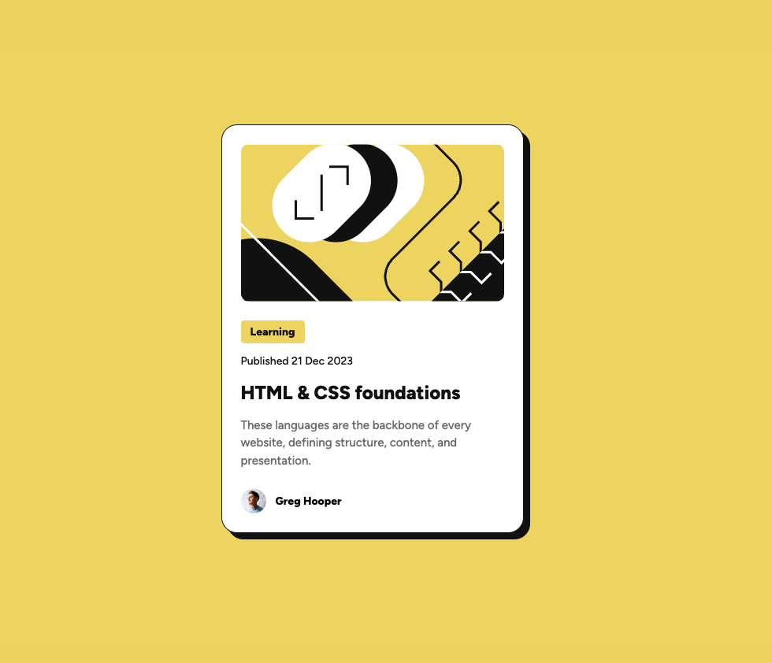

# Frontend Mentor - Blog preview card solution

This is a solution to the [Blog preview card challenge on Frontend Mentor](https://www.frontendmentor.io/challenges/blog-preview-card-ckPaj01IcS). Frontend Mentor challenges help you improve your coding skills by building realistic projects.

## Table of contents

- [Frontend Mentor - Blog preview card solution](#frontend-mentor---blog-preview-card-solution)
  - [Table of contents](#table-of-contents)
    - [Screenshot](#screenshot)
    - [Links](#links)
    - [Built with](#built-with)

### Screenshot

### Links

- Solution URL: [Add solution URL here](https://github.com/j-alvarezsone/blog-preview-card)
- Live Site URL: [Add live site URL here](https://j-alvarezsone.github.io/blog-preview-card/)

### Built with

- HTML5
- CSS
